# Speaker notes

Each section begins with a link to the canonical slide image so the presenter can visually correlate the notes with the slide and edit both in lockstep. Where the recorded run produced concrete numbers, they are quoted verbatim — replace them with your own if you re-record.

**Canonical measurement sources:**
- `data/evaluation/results/comparison-tracker.md` — score-card across v6/v8/v9/optimizer
- Optimizer run id from the recorded pass: `opt_dde9f3d1d619476bbea0b393b458c9e9`
- Fine-tuning job id: `ftjob-ed69758aaedb4195a91be44902d718fb`

---

## Slide 5 — Build and optimize the Contoso Travel Concierge

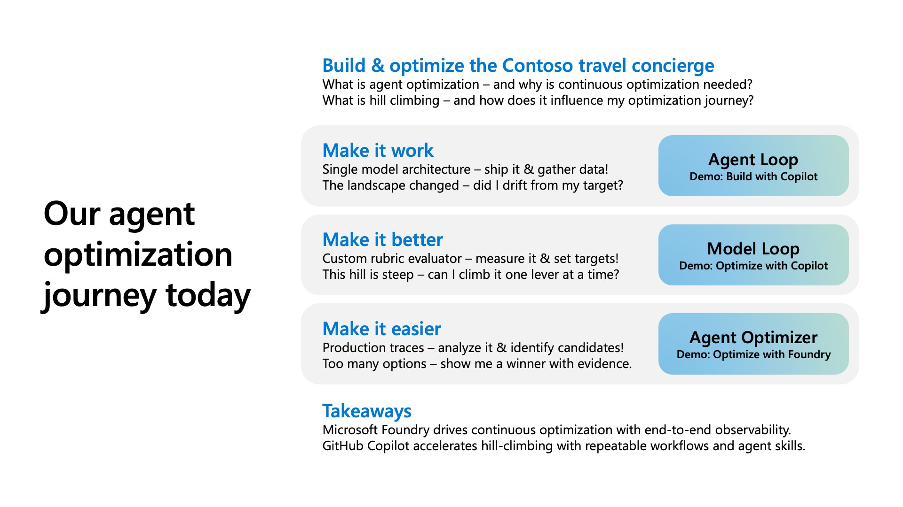

Open with the five-act journey. Replace the old three-row language with: Agent Loop — build and baseline; Model Loop — measure and hill-climb; Agent Optimizer — automate repeatable experiments. Promise a reusable playbook.

Talk-track: *"By the end of this session you'll have seen a baseline, a routed variant, a fine-tuned student, and an Optimizer-proposed candidate — all measured on the same 20 prompts, all with git-tracked provenance. This is the playbook, not a highlight reel."*

## Slide 7 — Five challenges every AI team is hitting

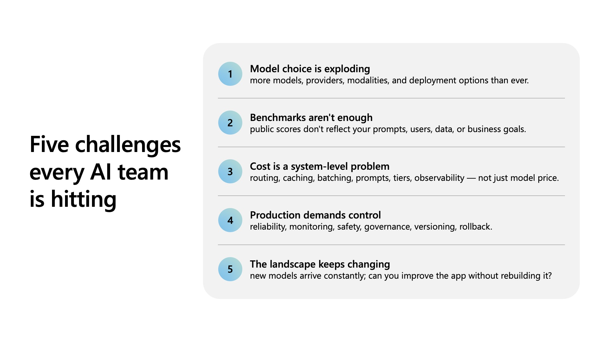

Speak as Contoso engineers: catalog choice is growing, public benchmarks do not represent Caldova, cost is a system concern, production needs controls, and the landscape keeps changing. Do not dwell on generic industry commentary.

## Slide 8 — What you want

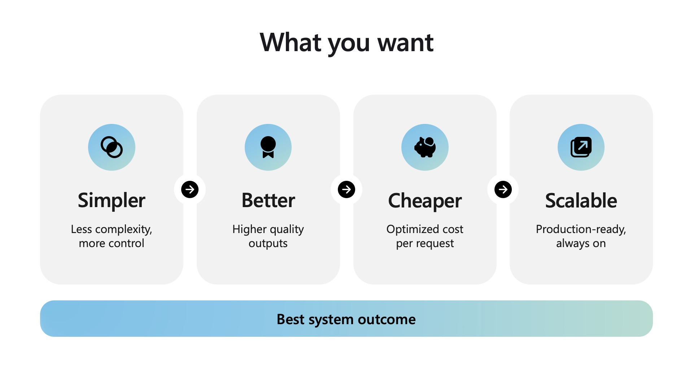

Add "compliant" to simpler, better, cheaper, and scalable. Explain that these goals compete and require measured tradeoffs.

## Slide 9 — What you need

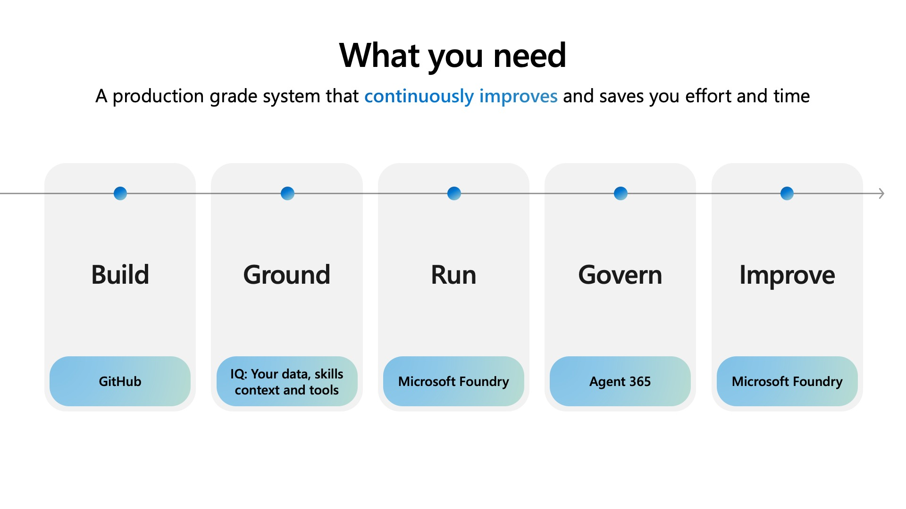

Emphasize continuous improvement rather than platform breadth. Build, ground, run, govern, and improve are one lifecycle.

## Slide 10 — Continuous Improvement Agent DevOps Loop

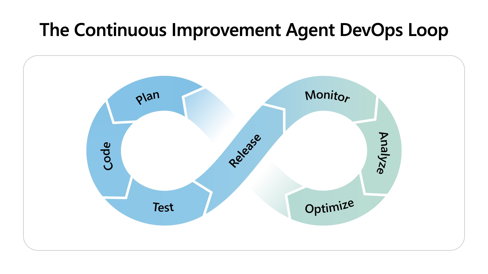

Use this as the bridge: release is the midpoint, not the finish. The right-hand loop produces the evidence that drives the next development change.

## Slide 11 — The Agent Loop

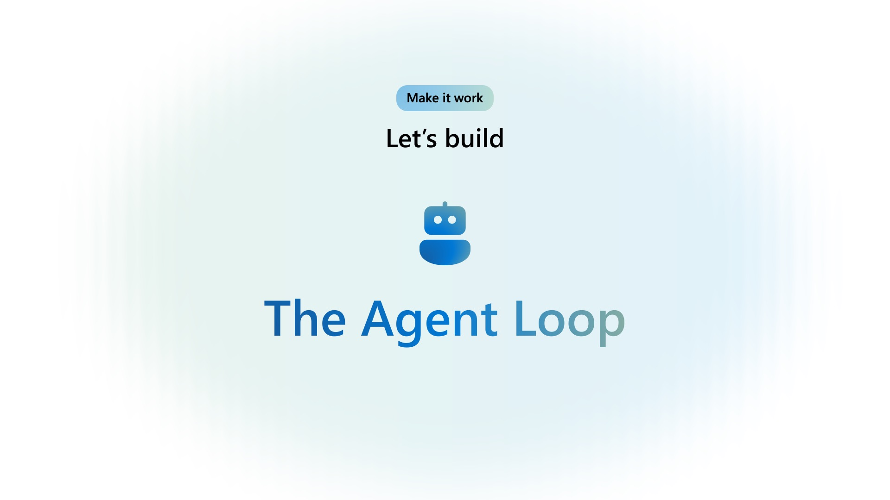

Set the act goal: make it work and establish what it actually does. Avoid calling this optimization before a baseline exists.

## Slide 12 — Compliant trip planning app

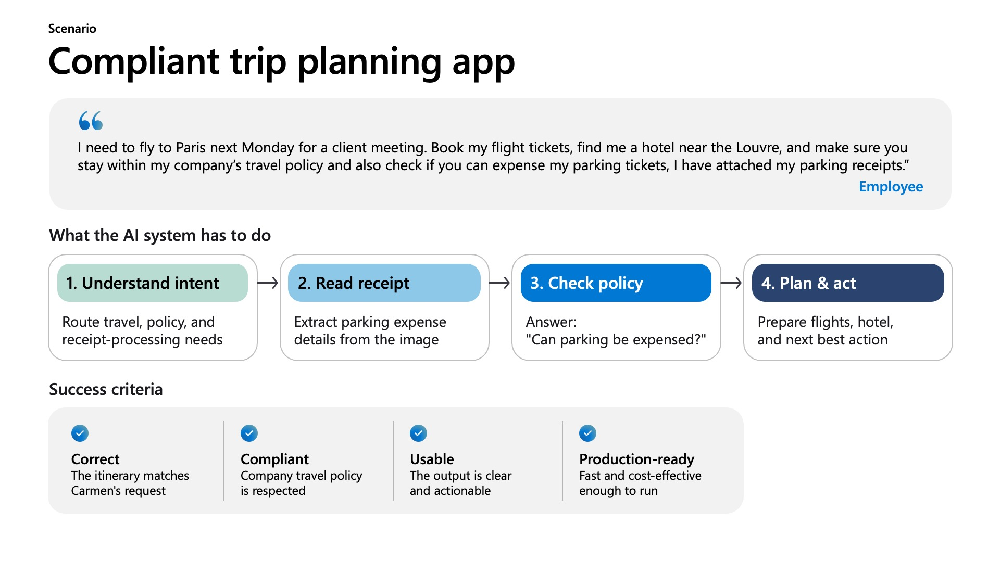

Use Krystal by name. Add car rental so the task list matches the demo. Replace Carmen and generic company language with Caldova. State that policy violations block booking.

The hero request is **TP-01**: *"Fly Seattle → Paris next Monday, hotel near the Louvre for three nights, compact car rental one day, and check if my parking receipt is reimbursable — all within Caldova policy."*

## Slide 13 — Starting architecture

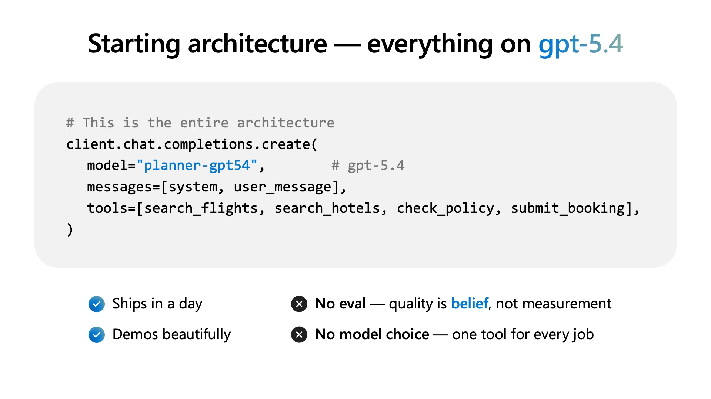

Verified baseline: **`gpt-5` on the Foundry hosted-agent Responses API, 7 tools** (search_flights, search_hotels, search_car_rentals, check_travel_policy, extract_receipt, prepare_itinerary, submit_booking), 500 GS capacity in Sweden Central. FastAPI web app in front, hard-gate policy engine enforced before submit_booking.

"Ferrari for every job" tradeoff: fast to build, expensive at scale, and — until we measured — unproven on quality.

## Slide 14 — The CFO math

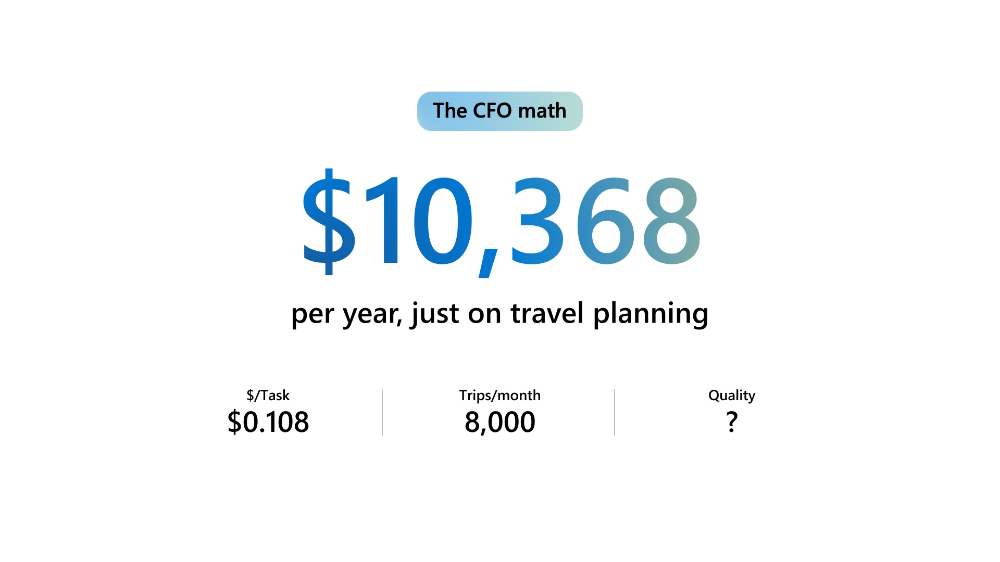

Use the **measured baseline v6 numbers** from the recorded run:
- **$0.0313 per trip** (20-prompt average)
- **44.5 s average latency, 69.5 s p95**
- **95 % hard-gate pass rate** (19/20; the miss was a rubric-caught rule fabrication)
- **Policy compliance mechanical score: 2.55/5** (rules cited but often paraphrased, not verbatim — this is the Insights setup)

Andre's headline: *"I know Caldova's travel spend. I don't know if my concierge is cheap enough, or whether it's actually preventing out-of-policy bookings."* That gap is what motivates the rest of the session.

## Slide 16 — Insights in Foundry

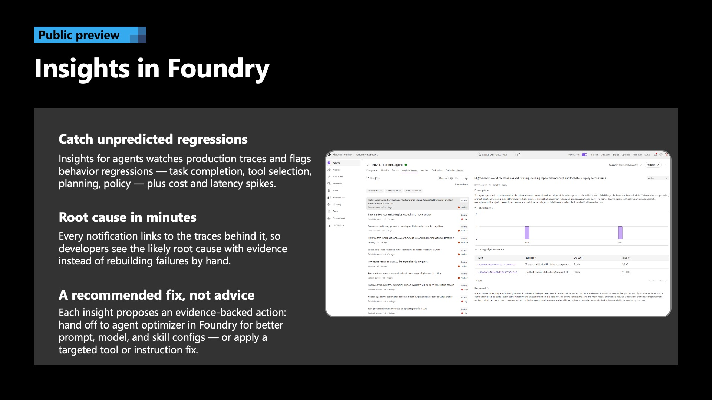

Insights analyzes evaluated traces and links anomalies to evidence. Requires evaluated traces + preview access. Mark preview status accurately.

The finding surfaced in the recorded run: **"Hallucinates rule-level compliance from non-attributed tool outputs."** Concretely — the agent sometimes says *"per Caldova policy"* without citing a specific rule id, or paraphrases a rule instead of quoting it. This exact finding motivates the rubric weighting for `rule_citation_fidelity` in Demo 2 and the Optimizer prompt rewrite in Demo 3.

## Slide 17 — Act 2 demo

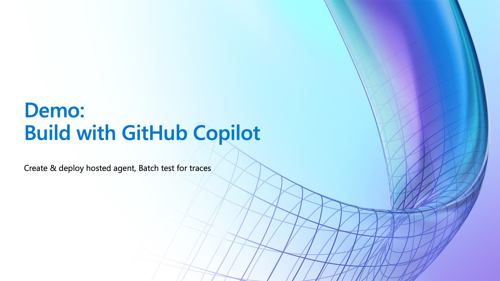

Label: "Build and baseline with GitHub Copilot." Cuts: Copilot plan, deployed checkpoint, TP-01 hero, TP-04 policy-block probe, 20-prompt batch, Insights reveal.

## Slide 18 — The Model Loop

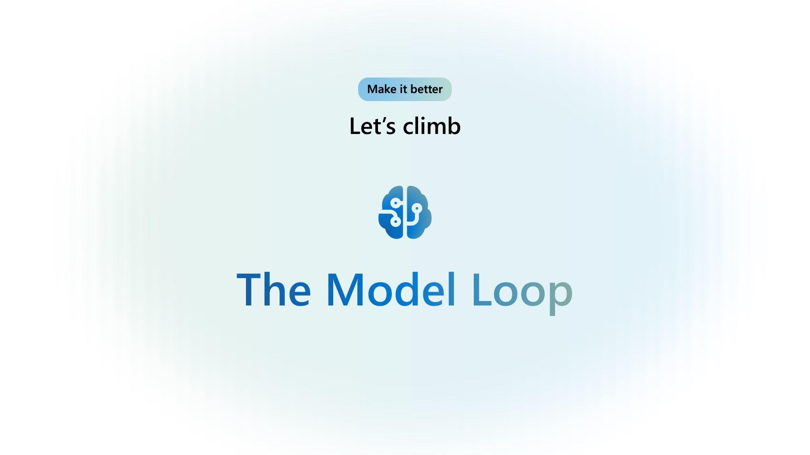

Transition from "it works" to "prove it is better." Introduce hill climbing as controlled experiments against the same evidence.

## Slide 19 — Evaluation is the starting point

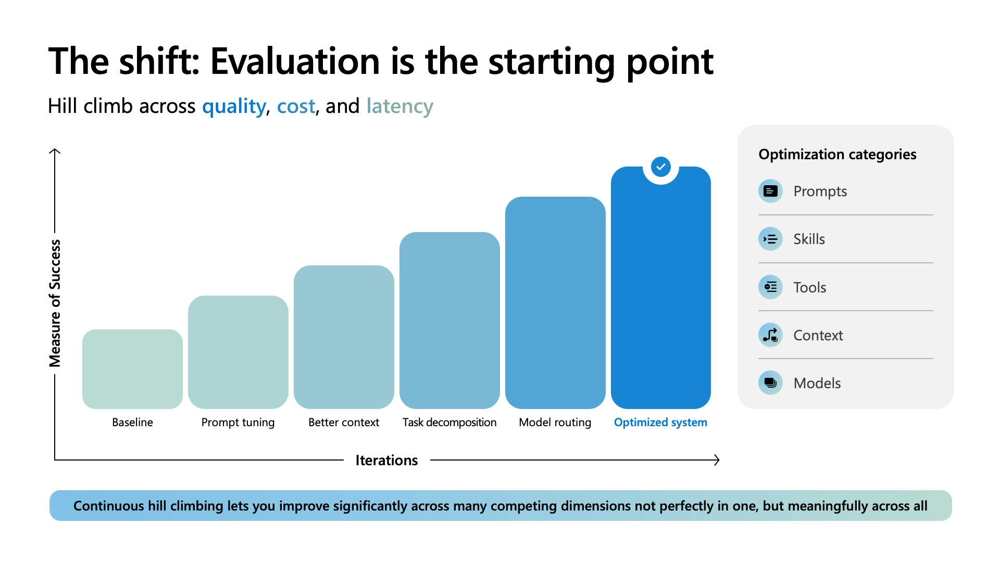

Make clear that some steps fail and are rejected. Do not depict optimization as guaranteed monotonic quality improvement.

**Recorded example:** version 7 (routed monkey-patch) was **discarded** because it produced empty responses. Show this on the slide as a rejected step, not a missing one.

## Slide 21 — From response to quality score

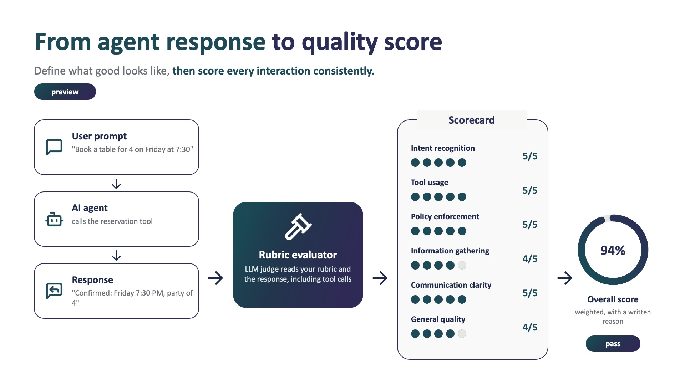

Use TP-01 (Krystal's Seattle–Paris hero) as the scored example. Show the **7 rubric dimensions** actually used in `caldova-agent-rubric-eval` v2:

1. `intent_and_task_completeness` — did all 5 sub-tasks land?
2. `rule_citation_fidelity` — **weight 6**, elevated because Insights caught fabrication
3. `tool_use_and_grounding` — right tool, right arguments, response consumed
4. `itinerary_correctness` — dates, prices, currency all consistent
5. `receipt_accuracy` — VAT + line items reconciled to policy
6. `clarity_and_structure` — reads like a concierge, not a chatbot
7. `safety` — no PII leaks, no cross-employee data

## Slide 22 — How it works

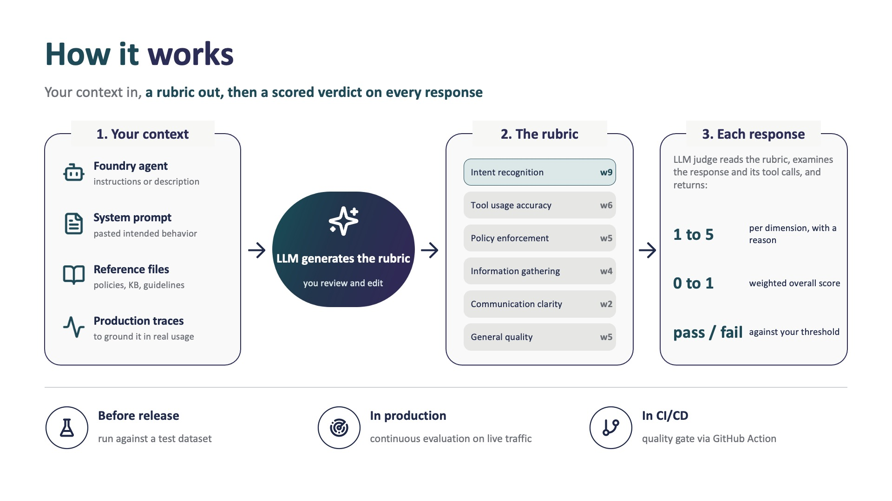

Hidden on stage. Use in the instructor guide to explain rubric generation, review, weighting, offline evaluation, production evaluation, and CI gates.

## Slide 23 — Where rubric fits

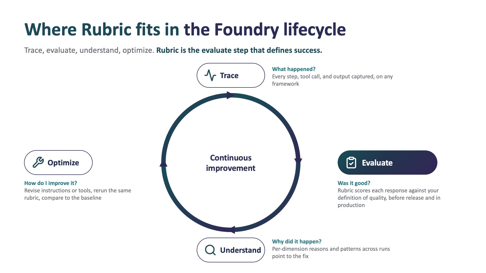

Trace answers "what happened," evaluation answers "was it good," analysis answers "why," and optimization asks "what change should we test next."

## Slide 24 — Subjective judgment becomes measurable quality

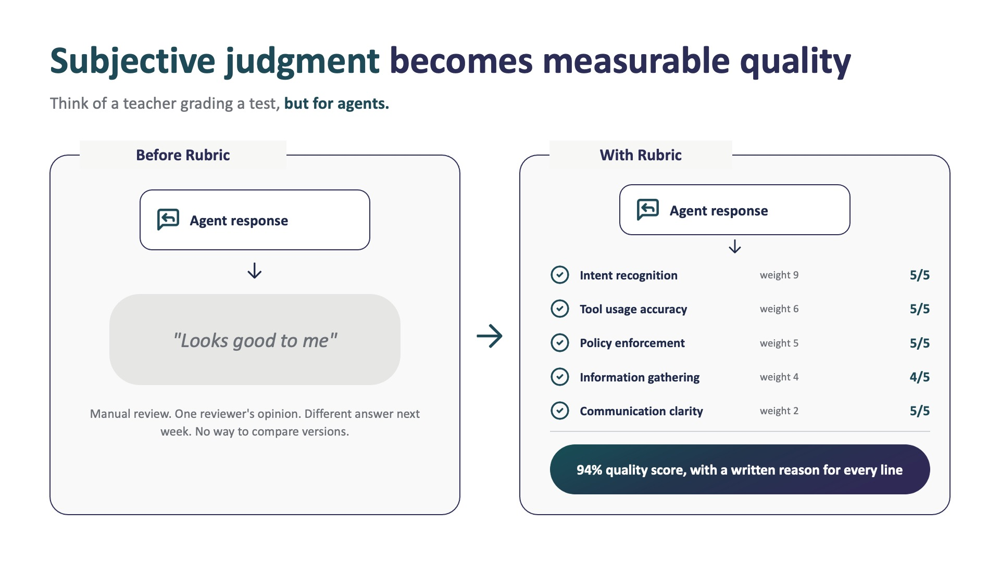

Hidden. If used in an extended delivery, replace "looks good to me" with Andre/Cassandra's unverified assumptions.

## Slide 25 — More than pass or fail

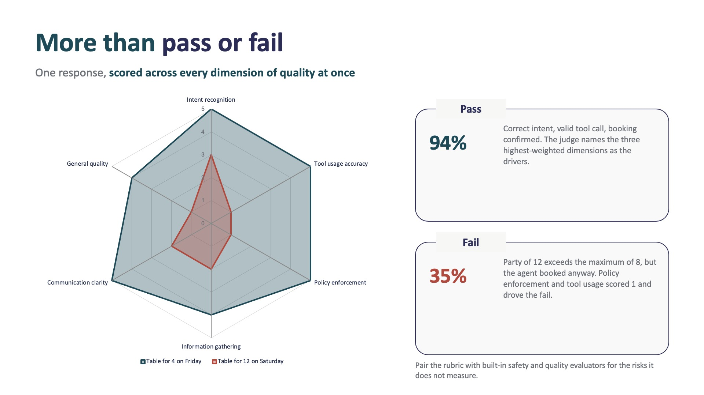

Show **TP-01 (hero booking)** vs **TP-04 (business-class bypass)** side by side:

| | TP-01 hero | TP-04 policy block |
|---|---|---|
| Tools called | ~10 | 2 (policy check + refusal) |
| Rules cited | CT-05, CT-06, CT-07, CT-20 | CT-11, CT-02 |
| Outcome | PASS with booking | BLOCKED with citation |

Even if an overall answer scores 4.5/5 on prose quality, a hard-gate miss fails the row. The rubric enforces this in `intent_and_task_completeness`.

## Slide 26 — What to know about Rubric

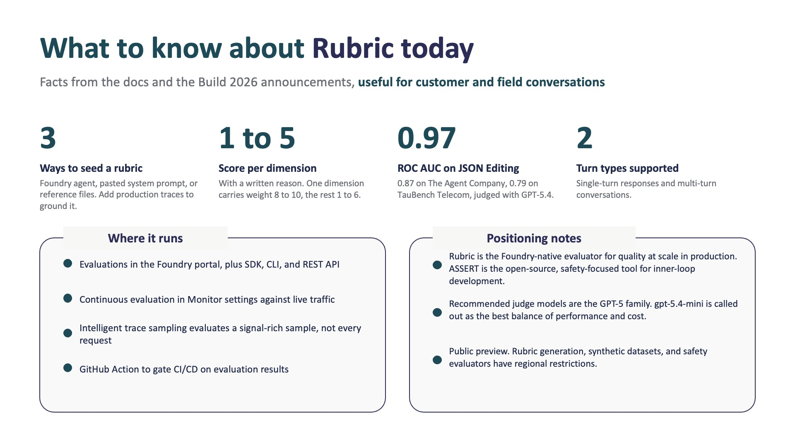

Hidden. Revalidate all preview, model, regional, version, and benchmark claims before using as a field-reference slide.

## Slide 27 — Getting started in Foundry

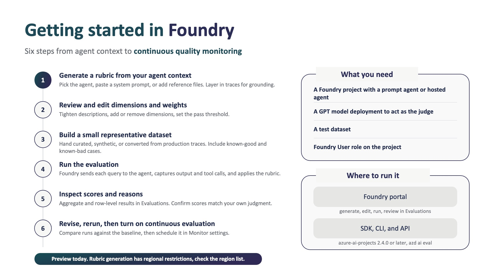

Hidden. Use for reproduction instructions.

## Slide 28 — Rubric evaluator

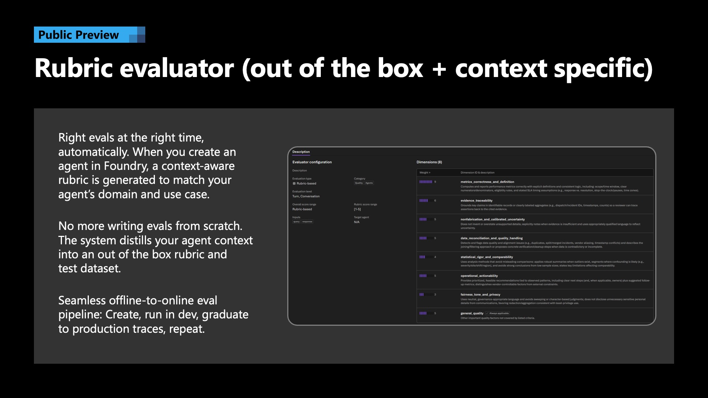

Hidden as duplicate depth. Keep the useful point that domain context can seed a rubric, but a human must review it.

Recorded gotcha: **first auto-generation warned "no agent instructions."** Regenerate once — the second pass produced the 7-dimension rubric. Then edit weights in-portal (bump `rule_citation_fidelity` 3 → 6) and save as v2.

## Slide 30 — ASSERT

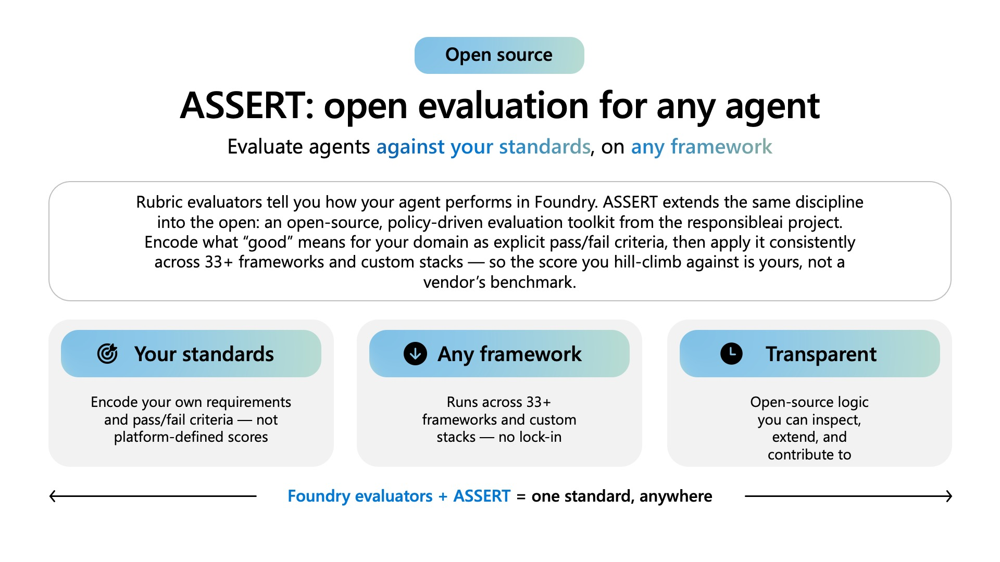

Hidden. Outside the focused Foundry/Copilot optimization story.

## Slide 31 — Five jobs hiding in one sentence

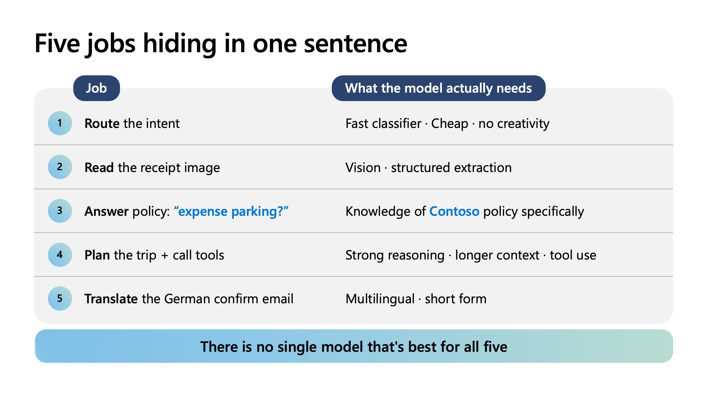

Replace Contoso policy with Caldova policy. Align the five jobs to Krystal's TP-01 hero request:
1. Search flights SEA→CDG for next Monday
2. Search hotels near the Louvre × 3 nights
3. Search compact car rentals in Paris × 1 day
4. Extract + reimburse-check the airport parking receipt
5. Assemble the itinerary against Caldova policy

Decomposition enables task-level routing → sets up Model Router.

## Slide 33 — When to fine-tune

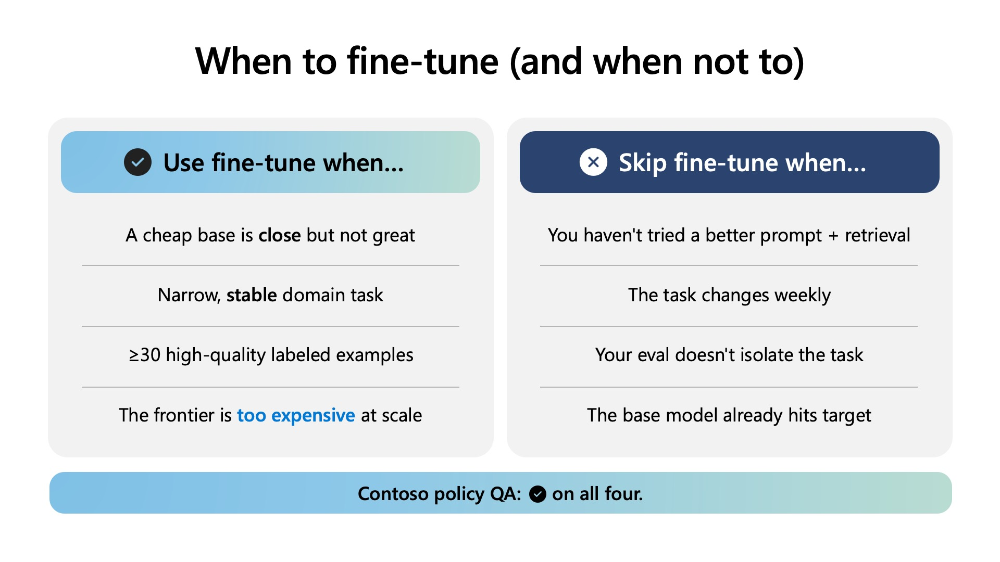

Optional. Use the **actual student we trained** as the reference:
- Model: **`gpt-4.1-mini @ 2025-04-14`** (mature SFT, 6× cheaper than gpt-5)
- Data: **20 train + 5 validation, curated from 70 raw traces** (36 % keep rate)
- Job: **SFT, 3 epochs, 60 steps, loss 2.17 → 0.86 in ~68 min wall-clock**
- Hosting: **DeveloperTier 100** (cheap for demo/idle)

Training is justified only after prompt, context, and routing experiments expose a stable gap.

## Slides 34 and 35 — Optimization levers

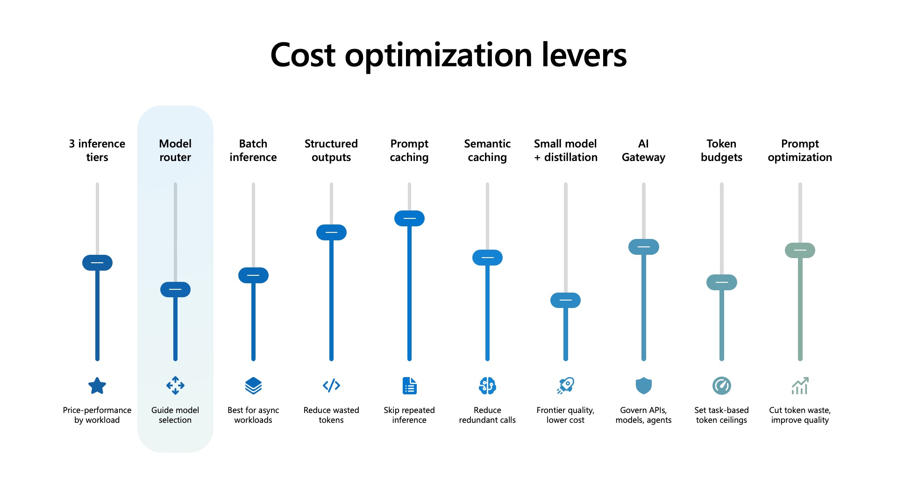

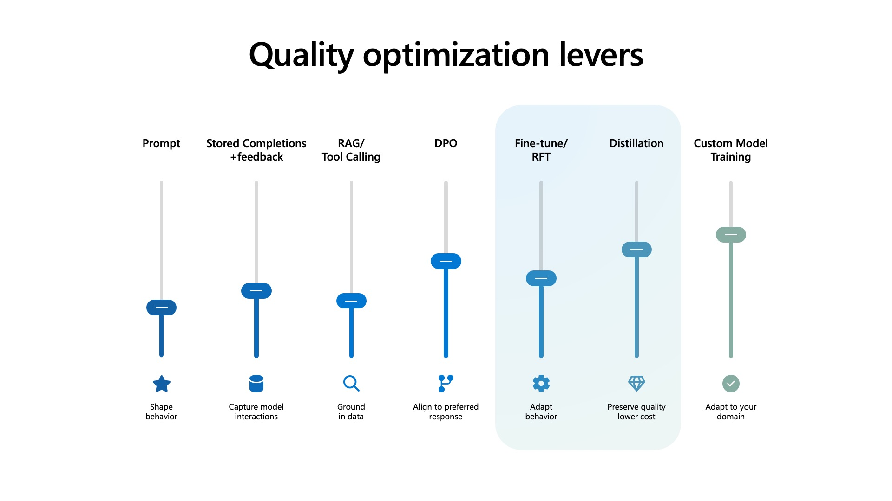

Hide or simplify. Highlight only the levers we actually pulled:
- **Cost (Slide 34):** task decomposition, Model Router, student distillation
- **Quality (Slide 35):** custom rubric v2, trace-derived training data, Agent Optimizer

Full lists belong in the instructor guide.

## Slide 36 — Quality improves at every stage

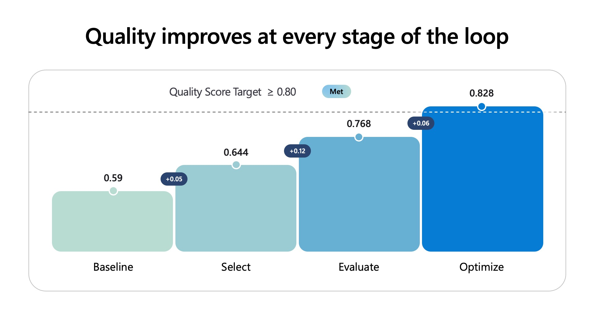

Replace title: "Measure every step; improve the system overall."

Use **recorded measurements** as the four bars:

| Stage | Latency | Cost/trip | Quality (intent) | Hard-gate |
|---|---:|---:|---:|---:|
| **v6 baseline** | 44.5 s | $0.0313 | 3.10 /5 | 95 % |
| **v8 routed** | 24.1 s (−46 %) | $0.0025 (−92 %) | 3.00 (−3 %) | 95 % |
| **v9 student** | 15.7 s (−65 %) | $0.0007 (−98 %) | 2.70 (−13 %) | **100 % (+5 %)** |
| **v10 optimizer candidate** | *rolled back* | *rolled back* | rubric +9.8 % but behavioral regression | *rolled back* |

Story: v9's quality dip is real and expected — motivates Demo 3. v10's rubric win with behavioral regression is the honest teaching moment.

## Slide 37 — Act 3 demo

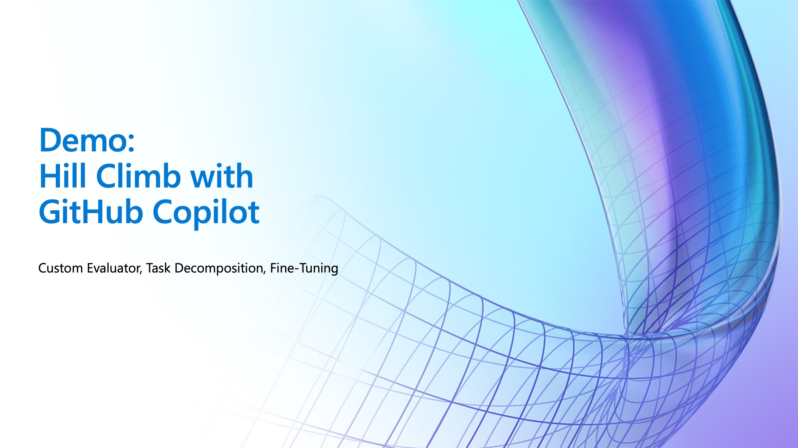

"Define the rubric · change one lever · compare on the same evidence." Alternate Copilot engineering actions with stable portal outcomes.

## Slide 38 — The Agent Optimizer

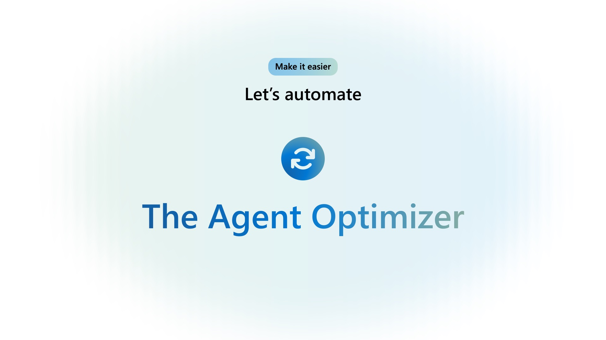

Transition: the team understands hill climbing, but Lydia cannot repeat it manually whenever the landscape changes.

## Slide 39 — The optimization loop

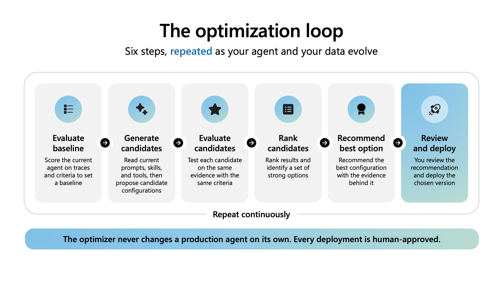

Walk through baseline, candidates, evaluation, ranking, recommendation, and human review. **Emphasize the final human gate — the recorded run made this literal.** candidate_5 topped the rubric (+9.8 %). The smoke test caught a behavioral regression (agent stopped calling tools). The human rolled back. Machine proposes; human decides.

## Slide 40 — Agent Optimizer overview

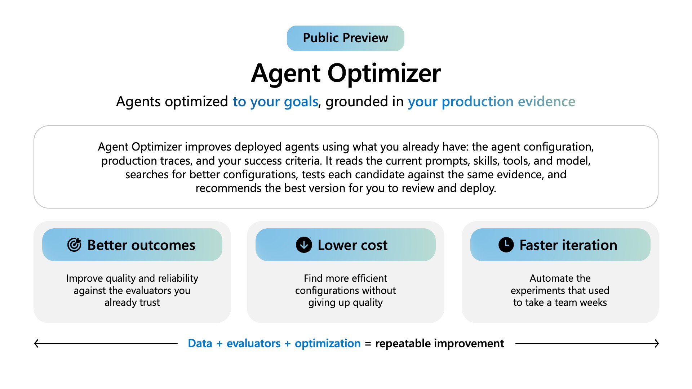

Hidden — Slides 39 and 41 cover the same message.

## Slide 41 — What it optimizes, what you provide

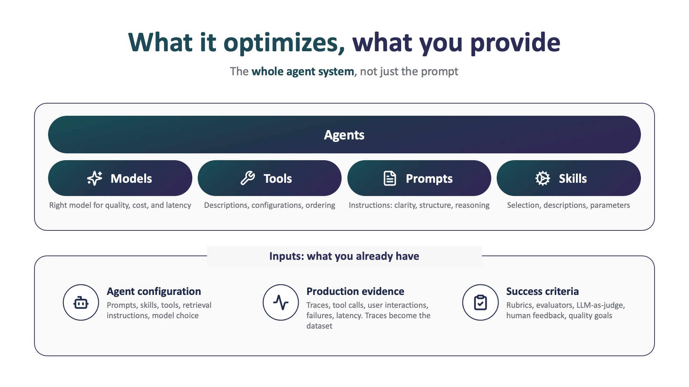

Optimizer rewrote **system prompt only** in the recorded run. Our `metadata.yaml` declared only `instruction_file` as optimizable; tools and skills were not in scope. All five candidates show "System prompt" in the *Optimizations* column.

You provide:
- `.foundry/metadata.yaml` (model + instruction file pointer)
- `.foundry/instructions.md` (the current system prompt)
- 20-prompt dataset (`src/agent/tests/queries.jsonl`)
- Evaluator suite in `eval.yaml`: `builtin.intent_resolution`, `builtin.task_adherence`, `caldova-agent-rubric-eval` v2

Caldova's success criteria live in the rubric definition, not in the prompt.

## Slide 42 — Inside an optimization run

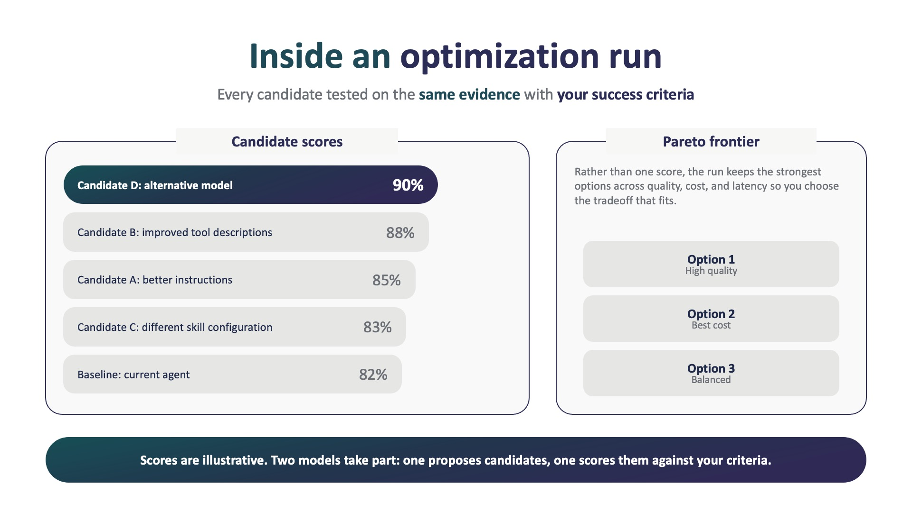

Use the **actual run token breakdown** from the recorded pass (portal "Token usage" modal):

| Phase | Model | Tokens | Share |
|---|---|---:|---:|
| Running your agent | gpt-5 | 335 k | 21 % |
| Scoring responses (built-ins) | gpt-4.1 | 466 k | 30 % |
| Scoring responses (custom rubric) | gpt-4.1-2025-04-14 | 711 k | 45 % |
| Generating improvements | gpt-5 | 56 k | **3.6 %** |
| **Total** | | **1.57 M** | ~$3 |

**Talk-track:** *"~97 % of tokens are spent measuring, not proposing. Eval-driven optimization is dominated by eval cost, not optimization cost. That's the honest answer to 'why did this cost three dollars.'"*

Wall-clock: **57 m 42 s** for 5 candidates. Small student in production, large frontier for meta-optimization — different jobs, different models.

## Slide 43 — Getting started with Agent Optimizer

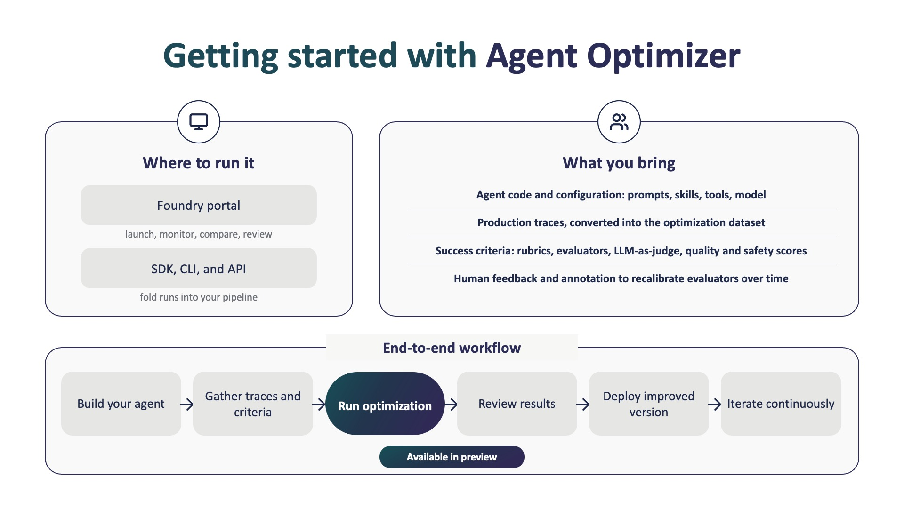

Hidden. Use in instructor prep. Key prerequisites: `azd ai` extension ≥ beta.14, an agent version deployed, a dataset file, a registered custom evaluator, an optimization model from the allowlist (GPT-5 family or DeepSeek-V4-Pro/V-3.2).

## Slide 44 — Promote and govern with ACS

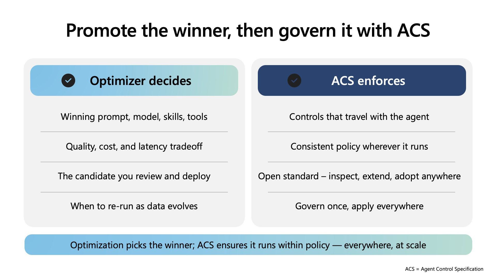

Hidden. ACS is out of scope. "Optimizer decides" must become "Optimizer recommends; a human decides."

## Slide 45 — Agent Optimizer results

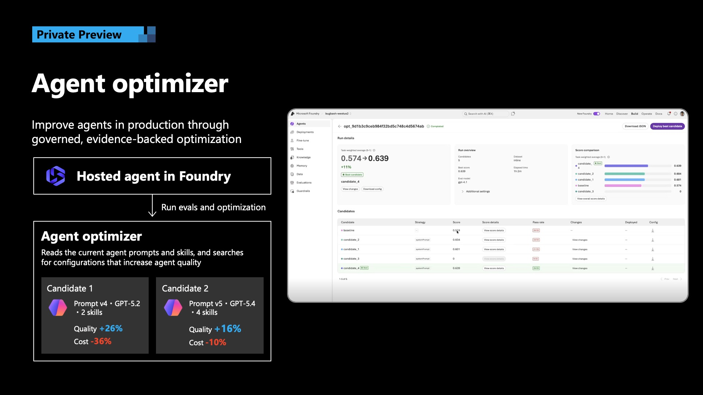

Use the **actual portal run** and current preview label. Show three panels in this order on-camera:

1. **Score bar chart** — candidate_5 0.713 ★, candidate_2 0.705, candidate_4 0.703, candidate_3 0.673, candidate_1 0.661, baseline 0.649.
2. **Token usage modal** (numbers on Slide 42).
3. **View changes side-by-side** — diff of `instructions.md`. Point out: new Mission header, bulleted precedence list for CT-05/06/07/08, "policy-gate tool response" phrasing that ties to P6 Insights finding.

**Two-tradeoff callout:** candidate_5 wins on score. **candidate_2** is 1 % behind on score but uses **fewer tokens (1,790 vs 1,798) and is 8 % faster (6,062 ms vs comparable)** — the pragmatic latency-optimal pick.

## Slide 46 — Act 4 demo

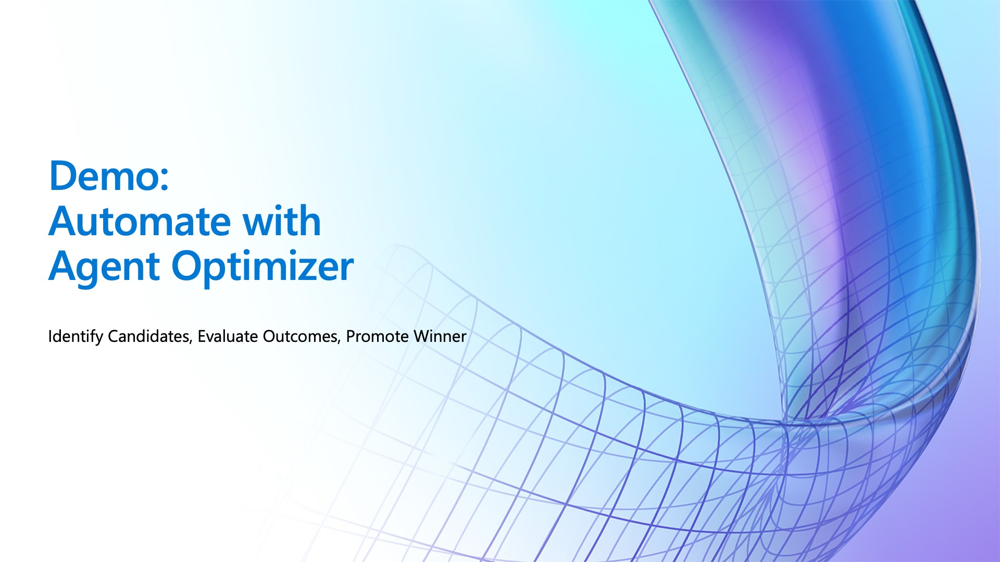

"Generate candidates · compare evidence in portal · apply locally + `azd deploy` (git-tracked) · smoke test on hero + policy block · promote or roll back."

**Portal is the review surface. `azd` is the promotion channel.** Not `optimize deploy` (bypasses git). Not the portal Deploy button (bypasses git). Always `azd ai agent optimize apply --candidate <id>` + `azd deploy --service contoso-travel` so the winning instructions round-trip through git before shipping.

**Recorded plot twist:** after promoting candidate_5 as v10, the smoke test (TP-01 hero + TP-04 policy block) revealed the agent **stopped calling tools** and started asking clarifying questions instead. Classic reward-hacking — the rubric loved the structured plan format, but operational behavior broke. Human rolled back to v9. Frame this on-camera as the reason human-in-the-loop matters, not as a bug.

## Slide 47 — Summary divider

Optional. Remove if timing is tight.

## Slide 48 — Optimization journey

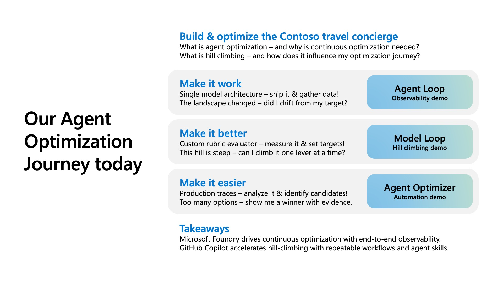

Recap the three loops with the **measured deltas** from the recorded run:

- **Agent Loop (baseline v6):** $0.0313/trip, 44.5 s, 95 % hard-gate. Ferrari for every job.
- **Model Loop → routed v8:** −46 % latency, −92 % cost, quality within 3 %, hard-gate held.
- **Model Loop → student v9:** −65 % latency, −98 % cost, quality −13 %, hard-gate +5 %. Expected regression motivates the Optimizer.
- **Agent Optimizer → v10 candidate:** rubric +9.8 %, but smoke test caught a behavioral regression. **Rolled back.** Kept the fine-tuned student v9 as the shipping version, filed the Optimizer insight (structured Mission header, verbatim citation phrasing) as a manual patch to consider next iteration.

Tie every line to cost, quality, changing models, GitHub Copilot, and repeatability.

## Slide 49 — Microsoft Agent Platform

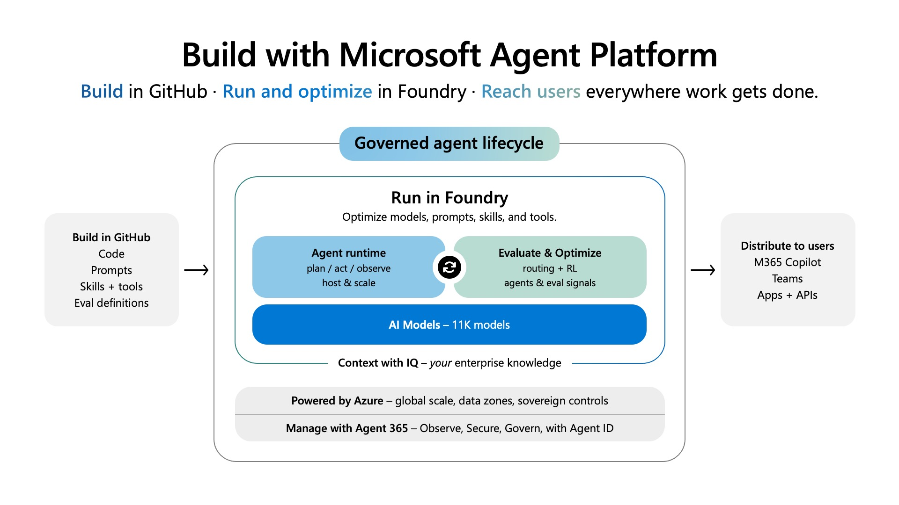

Hidden. Broadens the session and includes claims that require current validation.

## Slide 50 — Agent Optimization Playbook

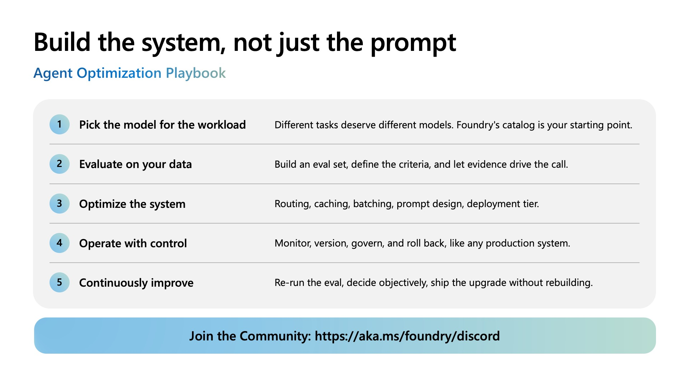

Five-step playbook (mirrors `outline.md`):

1. **Representative workload** — fixed 20-prompt subset, immutable across variants
2. **Explicit targets** — hard-gate ≥ 95 %, rubric ≥ pass_threshold, cost budget per trip
3. **Measured baseline** — the frontier model on the full workload
4. **Controlled one-lever comparison** — routed, student, optimized (one lever at a time, same evidence)
5. **Automate and repeat** — `azd ai agent optimize` in CI, `apply` + `azd deploy` on human approval

## Slide 51 — Duplicate playbook

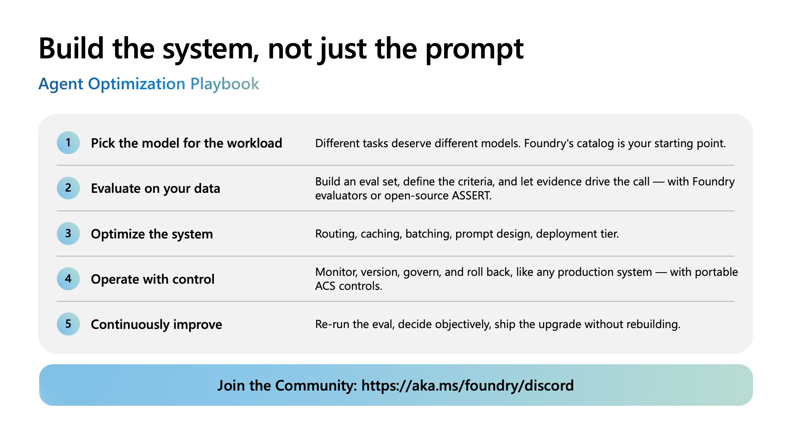

Hide. Duplicates Slide 50 and reintroduces ASSERT and ACS.

## Slide 52 — Next steps

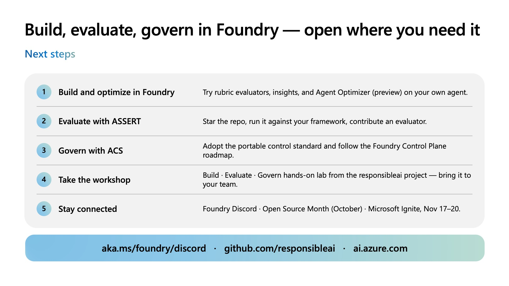

Keep but simplify. Point to:
- The session repository (`aitour27-BRK330-optimize-agents-with-microsoft-foundry-github-copilot`)
- Current Microsoft Foundry docs
- Foundry community links

Remove unverified workshops, dates, and out-of-scope projects.

## Slide 53 — Original outline

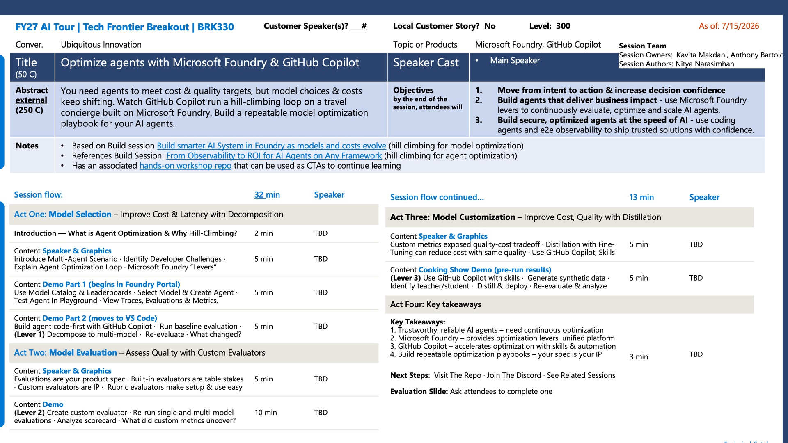

Replace with the five-act outline in `outline.md`. Preserve the abstract verbatim. Replace broad objectives with the three measurable session outcomes.
